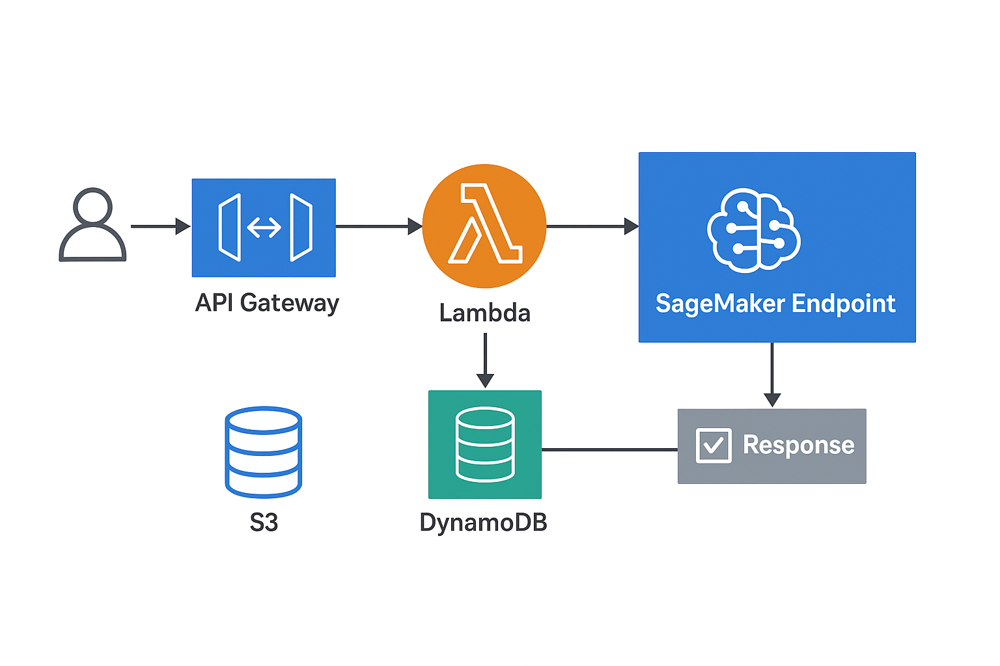

# 🛡️ Phishing URL Detection System (AI + AWS)

An AI-powered cybersecurity project that detects phishing URLs using AWS services like SageMaker, Lambda, API Gateway, and DynamoDB.

---

## 🧠 Architecture Overview


---

## ⚙️ Tech Stack
- **AWS SageMaker** – Model training & deployment
- **AWS Lambda** – Serverless inference
- **Amazon API Gateway** – REST API endpoint
- **Amazon DynamoDB** – Store prediction logs
- **Amazon S3** – Dataset & model storage

---

## 🚀 Setup Guide

### 1️⃣ Dataset Preparation
Upload `phishing_dataset.csv` to an S3 bucket.

### 2️⃣ Train Model
Run `model/training/train_model.ipynb` in SageMaker to:
- Extract URL features
- Train classifier (XGBoost or Logistic Regression)
- Save model artifact to S3

### 3️⃣ Deploy Model
Deploy using `model/deployment/deploy_model.ipynb`.
This creates a SageMaker endpoint for real-time inference.

### 4️⃣ Setup Lambda + API Gateway
- Deploy `lambda/lambda_function.py`
- Connect to SageMaker endpoint
- Create REST API in API Gateway

### 5️⃣ DynamoDB
Create a table named `PhishingDetections` with:
```json
{
  "url": "String (Primary Key)",
  "prediction": "String",
  "score": "Number",
  "timestamp": "String"
}

phishing-url-detector/
│
├── README.md
├── LICENSE
├── .gitignore
│
├── data/
│   ├── raw/
│   │   └── phishing_dataset.csv         # Original dataset
│   ├── processed/
│   │   └── features.csv                 # Feature-engineered data
│   └── notebooks/
│       └── data_preparation.ipynb       # Data cleaning & feature extraction
│
├── model/
│   ├── training/
│   │   └── train_model.ipynb            # SageMaker-compatible training notebook
│   ├── scripts/
│   │   └── train.py                     # Training script for SageMaker job
│   ├── output/
│   │   └── model.tar.gz                 # Trained model artifact
│   └── deployment/
│       ├── inference.py                 # SageMaker inference code
│       └── deploy_model.ipynb           # Notebook to deploy model endpoint
│
├── lambda/
│   ├── lambda_function.py               # AWS Lambda handler for inference
│   ├── requirements.txt                 # Lambda dependencies
│   └── test_event.json                  # Sample test input for Lambda
│
├── infrastructure/
│   ├── api_gateway_config.yaml          # API Gateway setup
│   ├── dynamodb_schema.json             # DynamoDB table definition
│   ├── cloudformation_template.yaml     # Optional IaC template
│   └── s3_bucket_policy.json            # S3 bucket permissions
│
├── frontend/
│   ├── index.html                       # Simple input form for testing
│   ├── script.js                        # Calls API Gateway endpoint
│   └── style.css
│
└── docs/
    ├── architecture-diagram.png         # AWS architecture (from earlier)
    └── setup_guide.md                   # Step-by-step AWS deployment guide
