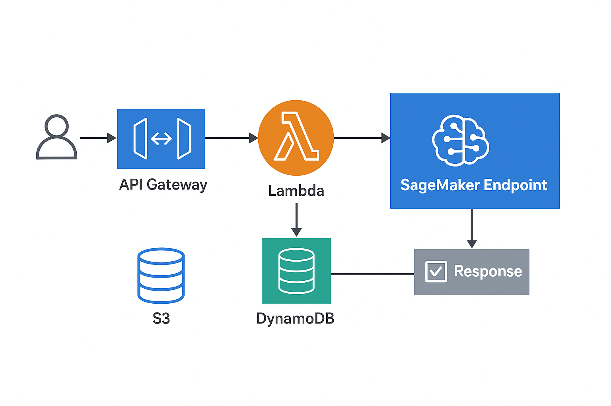

# 🛡️ Phishing URL Detection System (AI + AWS)

[](LICENSE)
[](https://www.python.org/)

An AI-powered cybersecurity project that detects phishing URLs using AWS services like SageMaker, Lambda, API Gateway, and DynamoDB. This repository contains notebooks, helper scripts, and Lambda code to train, deploy, and serve a URL classification model.

---

## 🧭 Quick links

- Architecture diagram: `docs/architecture-diagram.png`
- Data preparation notebook: `data/notebooks/data_preparation.ipynb`
- Training notebook: `model/training/train_model.ipynb`
- Deployment notebook: `model/deployment/deploy_model.ipynb`
- Lambda handler: `lambda/lambda_function.py`

---

## 🧠 Architecture Overview



The pipeline is: dataset in S3 → feature extraction → model training (SageMaker) → endpoint deployed → API Gateway + Lambda call endpoint → predictions logged to DynamoDB.

---

## ⚙️ Tech Stack
- **AWS SageMaker** – Model training & deployment
- **AWS Lambda** – Serverless inference
- **Amazon API Gateway** – REST API endpoint
- **Amazon DynamoDB** – Store prediction logs
- **Amazon S3** – Dataset & model storage
- **XGBoost / scikit-learn** – Model training

---

## Getting started

This section gives a concise path to go from cloning the repo to testing the deployed endpoint.

### Prerequisites

- Python 3.9+ (recommended)
- AWS CLI configured with an AWS profile that has permissions for S3, SageMaker, Lambda, API Gateway and DynamoDB
- An S3 bucket to store data and model artifacts
- (Optional) Docker & AWS SAM for local Lambda testing

IAM note: for experimentation you may attach AWS managed policies such as `AmazonSageMakerFullAccess`, `AWSLambdaFullAccess`, `AmazonS3FullAccess`, `AmazonDynamoDBFullAccess`. For production use least-privilege roles are recommended.

### Clone and setup (local development)

```powershell
# clone and enter repo
git clone <repo-url>
cd Phishing-URL-Detection-System

# create virtualenv and install lambda deps
python -m venv .venv
.\.venv\\Scripts\\Activate.ps1
pip install --upgrade pip
pip install -r lambda/requirements.txt
```

If you plan to run the notebooks in a Jupyter environment, install the notebook dependencies listed in `model/training/requirements.txt` (if present) or install major libs such as `boto3`, `pandas`, `scikit-learn`, `xgboost`.

---

## Data and model

- Raw datasets live in `data/raw/` (example: `phishing_dataset.csv`).
- Processed features are in `data/processed/features.csv`.
- Training notebooks and scripts are in `model/training/` and `model/scripts/`.
- Trained artifacts (optional) are placed under `model/output/` or an S3 bucket defined by the training notebook.

### XGBoost model format (JSON recommended)

Note: recent XGBoost releases deprecated and removed the old binary model format used by some SageMaker artifacts. To ensure forward compatibility we recommend saving the model as JSON (or UBJ). This repository includes a helper script to port a SageMaker `xgboost-model` artifact to JSON:

```powershell
# extract & convert a SageMaker model artifact to JSON
python .\scripts\port_xgboost_to_json.py --artifact model\output\model.tar.gz --out model\output\model.json
```

If you need to load a legacy binary model locally, either run the above conversion (preferred) or install an older XGBoost (for example 1.5.2) in a dedicated virtual environment, perform the conversion, then switch back to your normal environment. The FastAPI server will prefer `model/output/model.json` if present, then fall back to legacy artifact loading.

Model summary (example / update when you have exact metrics):

- Model type: XGBoost classifier (or Logistic Regression fallback)
- Primary features: URL length, count of special characters, presence of 'https', suspicious tokens, domain indicators
- Typical metrics: Accuracy ~ 0.9, AUC ~ 0.92 (replace with actual metrics from `model/output` once available)

Please include dataset source and license where applicable.

---

## Train & deploy (SageMaker)

1. Upload your raw CSV to S3 (bucket: `s3://your-bucket/path/`).
2. Edit `model/training/train_model.ipynb` to point to your S3 paths and SageMaker role.
3. Run the training notebook in SageMaker. The notebook will output a model artifact (for example `model.tar.gz`) to S3.
4. Run `model/deployment/deploy_model.ipynb` to create a SageMaker endpoint. Note the endpoint name; the Lambda in `lambda/lambda_function.py` expects the endpoint name to be supplied via environment variables or configuration.

---

## Deploy Lambda and API Gateway

High level steps:

- Package and deploy `lambda/` code (you can use AWS Console, SAM, or Terraform/CloudFormation available in `infrastructure/`).
- Configure environment variables for the Lambda function: SAGEMAKER_ENDPOINT, DYNAMODB_TABLE (defaults to `PhishingDetections`), LOG_LEVEL, etc.
- Create an API Gateway REST API and connect a POST method to trigger the Lambda.

### Example: invoke API (after deployment)

Replace `{api_url}` with your API Gateway endpoint URL.

```bash
curl -X POST {api_url}/predict -H "Content-Type: application/json" -d '{"url":"http://example.com/login"}'
```

Response example:

```json
{
  "url": "http://example.com/login",
  "prediction": "phishing",
  "score": 0.87
}
```

---

## DynamoDB schema

Create a table named `PhishingDetections` with a primary key `url` (String). Example item:

```json
{
  "url": "http://example.com/login",
  "prediction": "phishing",
  "score": 0.87,
  "timestamp": "2025-10-18T12:34:56Z"
}
```

---

## Project layout

```
phishing-url-detector/
│
├── README.md
├── LICENSE
├── .gitignore
│
├── data/
│   ├── raw/
│   │   └── phishing_dataset.csv         # Original dataset
│   ├── processed/
│   │   └── features.csv                 # Feature-engineered data
│   └── notebooks/
│       └── data_preparation.ipynb       # Data cleaning & feature extraction
│
├── model/
│   ├── training/
│   │   └── train_model.ipynb            # SageMaker-compatible training notebook
    │   └── requirements.txt                 # Lambda dependencies
│   ├── scripts/
│   │   └── train.py                     # Training script for SageMaker job
│   ├── output/
│   │   └── model.tar.gz                 # Trained model artifact
│   └── deployment/
│       ├── inference.py                 # SageMaker inference code
│       └── deploy_model.ipynb           # Notebook to deploy model endpoint
│
├── lambda/
│   ├── lambda_function.py               # AWS Lambda handler for inference
│   └── test_event.json                  # Sample test input for Lambda
│
├── infrastructure/
│   ├── api_gateway_config.yaml          # API Gateway setup
│   ├── dynamodb_schema.json             # DynamoDB table definition
│   ├── cloudformation_template.yaml     # Optional IaC template
│   └── s3_bucket_policy.json            # S3 bucket permissions
│
├── frontend/
│   ├── index.html                       # Simple input form for testing
│   ├── script.js                        # Calls API Gateway endpoint
│   └── style.css
│
└── docs/
    ├── architecture-diagram.png         # AWS architecture (from earlier)
    └── setup_guide.md                   # Step-by-step AWS deployment guide
```

---

## Quick testing (local)

Run the Lambda handler directly using the included `test_event.json` to verify basic wiring:

```powershell
# activate venv
.\.venv\\Scripts\\Activate.ps1
# run handler
python -c "import json; from lambda.lambda_function import lambda_handler; print(lambda_handler(json.load(open('lambda/test_event.json')), None))"
```

Invoke a deployed Lambda via AWS CLI (replace `<function-name>`):

```powershell
aws lambda invoke --function-name <function-name> --payload file://lambda/test_event.json response.json
Get-Content response.json
```

---

## Contributing

Contributions are welcome. Please:

1. Fork the repo and create a feature branch off `main`.
2. Add tests where possible and update notebooks/scripts.
3. Open a PR describing your changes and reference any issues.

Please follow standard GitHub flow and keep commits small and descriptive.

---

## License

This project is licensed under the MIT License — see the `LICENSE` file for details.

---

## Next steps & TODO

- Add concrete model evaluation metrics produced by training runs and store them in `model/output/metrics.json`.
- Add CI to run linting and basic unit tests for helper scripts.
- Add a script to package and locally test Lambda using SAM.

---
